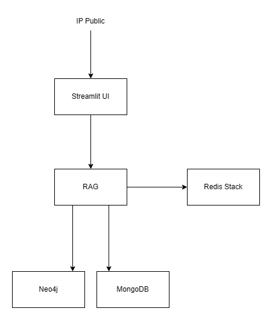
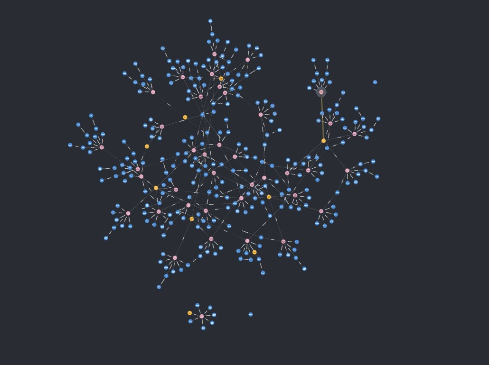
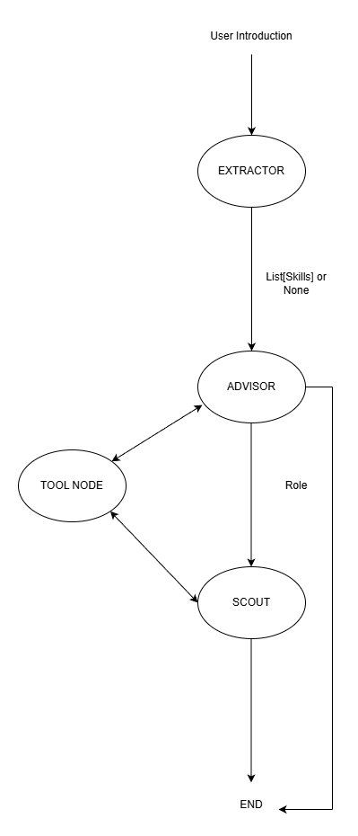

# Kartog AI

**Status:** In Development | **Language:** Python | **Infrastructure:** Docker

[Prezentare proiect](https://www.canva.com/design/DAG_C-2JKns/WMN_ucyutxqJsIT0zjy3mA/edit?utm_content=DAG_C-2JKns&utm_campaign=designshare&utm_medium=link2&utm_source=sharebutton)


[Videoclip DEMO](https://youtu.be/ucNr6DzTvjE)

## Table of Contents
1. [Introducere și Obiective](#1-introducere-și-obiective)
2. [Arhitectura Sistemului](#2-arhitectura-sistemului)
3. [Stratul de Date (Data Layer)](#3-stratul-de-date-data-layer)
4. [Logica de Caching Semantic (Redis)](#4-logica-de-caching-semantic-redis)
5. [Logica AI și RAG (LangGraph)](#5-logica-ai-și-rag-langgraph)
6. [Tool-uri și Recuperarea Informației](#6-tool-uri-și-recuperarea-informației-retrieval)
7. [Monitorizare și Observabilitate](#7-monitorizare-și-observabilitate)
8. [Instalare și Configurare](#8-instalare-și-configurare)
9. [Bibliografie](#9-bibliografie)

---

## 1. Introducere și Obiective

### Prezentarea generală a aplicației
Kartog AI este o platformă software destinată orientării profesionale. 
Aplicația utilizează o arhitectură bazată pe agenți inteligenți pentru a analiza profilul utilizatorului și a identifica oportunități în piața muncii.

### Problema rezolvată
Platformele tradiționale funcționează pe principiul "Keyword Matching" (potrivire exactă de cuvinte).
* Exemplu: Dacă un CV conține "Python" și anunțul conține "Python", avem un match.
* Defectul: Această abordare ignoră nuanțele semantice (ex: "Data Science" implică "Python", chiar dacă nu e specificat explicit) și, mai important, nu oferă direcție. Utilizatorul primește o listă de joburi, dar nu știe de ce a fost refuzat la altele sau ce îi lipsește pentru a avansa.

### Soluția propusă
Soluția noastră transformă procesul dintr-o simplă căutare într-un proces de consultanță de carieră, folosind Grounding în date reale. Agenții AI nu "ghicesc", ci își fundamentează răspunsurile în două surse de adevăr:
* Grounding în Ontologie (Neo4j) - Pentru a înțelege logic cariera
* Grounding în Piață (MongoDB) - Pentru a valida oportunitatea

### Stack-ul Tehnologic
* **Limbaj:** Python 3.10+
* **Orchestrare AI:** LangGraph
* **Baze de Date:** Neo4j (Graph), MongoDB (Vector & Document), Redis (Cache).
* **Infrastructură:** Docker, Docker Compose.

---

## 2. Arhitectura Sistemului

### Diagrama High-Level



### Fluxul de date (Data Flow)
1.  **Input:** Utilizatorul introduce descrierea experienței.
2.  **Procesare:** Inputul este vectorizat și verificat în Cache-ul Semantic.
3.  **Decizie:** Dacă nu există în cache, agenții LangGraph preiau sarcina.
4.  **Interogare:** Se extrag date din Graful de Cunoștințe (Neo4j) și Job Listings (MongoDB).
5.  **Output:** Se generează un plan de carieră și o listă de joburi relevante.

### Descrierea containerelor Docker
* `app`: Serviciul principal Python.
* `neo4j`: Baza de date graph pentru ontologia de cariere.
* `redis`: Stocare key-value pentru caching semantic.
* `prometheus`: Colector de metrici de sistem.
* `grafana`: Dashboard pentru vizualizarea metricilor.
* `watcher`: Script pentru detectarea schimbărilor in baza de date

---

## 3. Stratul de Date (Data Layer)

### Ontologia de Cariere (Neo4j)
Structura grafului este definita astfel:
* **Noduri:** `Role`, `Skill`, `Domain`
* **Relații:**
    * `(Role)-[:REQUIRES]->(Skill)`
    * `(Role)-[:RECOMMENDS]->(Skill)`
    * `(Role)-[:IN_DOMAIN]->(Domain)`
    * Relații semantice între `Skill`-uri (ex: `(:Skill)-[:IS_FRAMEWORK_FOR]->(:Skill)`)


### Screenshot Neo4j UI


### Generarea Sintetică a Datelor
Este important de menționat că **atât ontologia (schema) cât și datele efective** (conținutul nodurilor și relațiilor) au fost generate sintetic pentru a asigura scalabilitatea.

* **Sursa (Seed):** Lista reală de `job_title` extrasă din colecția MongoDB (pentru a ancora datele în realitate).
* **Generator:** Modelul **Gemini Pro**.
* **Proces:** Modelul a primit titlurile de joburi și a generat descrierile detaliate, a clasificat domeniile și a dedus listele de competențe necesare, eliminând nevoia de introducere manuală a datelor.
* **Script:** Logica de generare și inserare se regăsește în fișierul `insert_data.py`

### Integritatea Datelor (Constrângeri)
Pentru a menține consistența grafului și a evita duplicarea entităților, scriptul `insert_data.py` definește constrângeri stricte de unicitate (Unique Constraints) înainte de inserarea datelor.

```python
def setup_constraints():
    print("Setting up constraints...")
    constraints = [
        "CREATE CONSTRAINT IF NOT EXISTS FOR (r:Role) REQUIRE r.name IS UNIQUE",
        "CREATE CONSTRAINT IF NOT EXISTS FOR (s:Skill) REQUIRE s.name IS UNIQUE",
        "CREATE CONSTRAINT IF NOT EXISTS FOR (d:Domain) REQUIRE d.name IS UNIQUE",
    ]
    for q in constraints:
        run_query(q)
```

Aceste constrângeri garantează că nu vor exista două noduri cu același nume pentru Role, Skill sau Domain. Aceasta este o condiție esențială pentru funcționarea corectă a comenzii MERGE (upsert), asigurând că relațiile se leagă de noduri unice existente, nu de duplicate.

### Logica de Populare (ETL)
Procesul de inserare este iterativ și folosește clauza MERGE din Cypher pentru a construi graful incremental.

1. **Crearea Rolului și a Domeniului:** Se creează (sau se actualizează) nodul de Rol și se leagă de Domeniul său. Dacă domeniul există deja (ex: "IT"), rolul se va atașa la nodul existent.

```python
role_query = """
MERGE (r:Role {name: $role_name})
SET r.description = $desc

MERGE (d:Domain {name: $domain_name})
MERGE (r)-[:IN_DOMAIN]->(d)
"""
```

2. **Maparea Skill-urilor (Must Have vs. Nice to Have):** Se face distincția semantică între cerințe critice și opționale prin tipul relației și proprietăți pe relație.

* **[:REQUIRES {level: 'Mandatory'}]:** Skill-uri critice.
* **[:RECOMMENDS {level: 'Optional'}]:** Skill-uri preferabile.


### Job Listings (MongoDB)
* **Colecție:** `job-postings`
* **Structura Document:** 
```json
{
  "collection": "job-postings",
  "structure": {
      "job_title": "String",
      "job_description": "String",
      "required_skills": ["String"],
      "salary_range": "String",
      "location": "String",
      "company": "String",
      "experience_level": "String",
      "industry": "String",
      "job_type": "String",
      "date_posted": "Date",
      "embedding": ["Float"]
  }
}
```
* **Procesul de vectorizare:** Se utilizează funcția `vectorize_jobs_weighted` pentru a transforma descrierile textuale în vectori, permițând căutarea semantică.

### Strategia de "Soft Weighting" prin Structurarea Textului
Metoda `vectorize_jobs_weighted` nu trimite doar descrierea brută a jobului către modelul de embedding, ci construiește un text sintetic optimizat pentru a influența geometria vectorului rezultat.

```python
    title = job.get("job_title", "")
    desc = job.get("job_description", "") or job.get("description", "")
    loc = job.get("location", "Unknown")
    exp = job.get("experience_level", "Unknown")

    text_to_embed = (
        f"Location: {loc}. Experience: {exp}. Title: {title}. "
        f"Job for {title} in {loc} ({exp}). "
        f"Description: {desc}"
    )

    vector = embedding_model.embed_query(text_to_embed)
```

În modelele de limbaj, nu putem atribui numeric o "greutate" (ex: Locație = 0.8, Descriere = 0.2). Totuși, putem simula acest lucru prin două mecanisme ale LLM-urilor:

1. Positional Bias (Front-loading):

    Modelele tind să acorde o importanță mai mare tokenilor aflați la începutul secvenței.

    Prin plasarea șirului Location: {loc}. Experience: {exp}. chiar la început, forțăm vectorul să se orienteze primar după aceste coordonate geografice și de senioritate.

    
        

> "Our study uncovers a positional bias in embedding models, where sentences at the beginning of a document disproportionately influence the resulting embeddings. This bias is consistently observed across various models with different context sizes and datasets and is evident in both text insertion and removal experiments. [...]"
>
> - *Sursa: [Quantifying Positional Biases in Text Embedding Models (2025)](https://arxiv.org/pdf/2412.15241)*
    

2. Frequency Weighting:

    Observăm că variabilele {loc}, {exp} și {title} apar de două ori în textul de embedduit:

    O dată ca metadate explicite: Location: London.

    O a doua oară integrate într-o propoziție naturală: "Job for Software Engineer in London."

> "tf–idf (term frequency–inverse document frequency [...] was often used as a weighting factor in searches of information retrieval [...]"
>
> - *Sursa: [Wikipedia: tf-idf](https://en.wikipedia.org/wiki/Tf%E2%80%93idf)*

Astfel, un job perfect ca rol, dar în alt oraș, va avea un scor de similaritate mai mic (distanță vectorială mai mare) din cauza nepotrivirii pe dimensiunile dominante (Locație/Experiență).

* **Sursa date:** [Kaggle - IT Job Opportunities Dataset (2019-2023)](https://www.kaggle.com/datasets/saurav0507/it-job-opportunities-dataset-2019-2023/data)
---

## 4. Logica de Caching Semantic (Redis)

Semantic caching este un mecanism de optimizare care interpretează și stochează contextul semantic al unei interogări. Această abordare permite sistemului să returneze răspunsuri pre-calculate pentru interogări similare ca sens, nu neapărat identice lexical. 

Proiectul utilizează o arhitectură hibridă de caching pentru a limita cosumul de 'tokens' al modelelor de LLM utilizate (ex: funcția `extract_skills_with_semantic_cache`) și a optimiza interacțiunea cu bazele de date Neo4j și MongoDb (ex: funcțiile `find_best_role_match` și `search_mongodb_jobs`).

### Infrastructură și Configurare

Pentru implementarea mecanismului de Semantic Caching, sistemul utiizează imaginea `redis/redis-stack:latest` în detrimentul distribuției standard `redis`. Această alegere este motivată de faptul că, spre deosebire de versiunea standard, `redis-stack` include nativ modulele `RediSearch` și `RedisJSON`, transformând baza de date într-un vector store performant. Acest lucru permite stocarea interogărilor sub formă de embeddings și calcularea in timp real a distanței semantice.

Sistemul utilizează pentru vectorizare modelul `sentence-transformers/all-MiniLM-L6-v2`, o soluție compactă instalată local, care transformă interogările în reprezentări vectoriale de **384 de dimensiuni**, optimizate pentru o latență scăzută. Calculul distanței semantice se realizează prin metrica Cosine Similarity (`DISTANCE_METRIC: "COSINE"`). Spre deosebire de alte metrici care măsoară distanța fizică (Euclidiană), similaritatea cosinusoidală analizează unghiul dintre doi vectori într-un spațiu multidimensional.

$$\text{Distanța}(A, B) = 1 - \frac{\mathbf{A} \cdot \mathbf{B}}{\|\mathbf{A}\| \|\mathbf{B}\|} = 1 - \frac{\sum_{i=1}^{n} A_i B_i}{\sqrt{\sum_{i=1}^{n} A_i^2} \sqrt{\sum_{i=1}^{n} B_i^2}}$$


Indexul este definit ca `semantic_cache_idx` și stochează datele în format JSON.

### Implementarea sistemului de Semantic Caching și comparația cu sistemele standard (Exact Match)

Proiectul prezintă două straturi de caching: Standard (Exact Match) pentru interogări identice și Semantic (Vector Search) pentru interogări similare ca sens.

Pentru cache-ul standard, cheile trebuie să fie unice și deterministe. Funcția normalizează payload-ul JSON (prin sortarea cheilor) și generează un hash SHA256. Acest lucru asigură că { "a": 1, "b": 2 } și { "b": 2, "a": 1 } produc aceeași cheie de cache.

```python
def make_key(prefix: str, payload: dict) -> str:
    """
    Generates a deterministic cache key based on a prefix and a JSON-serializable payload.
    """
    raw = json.dumps(payload, sort_keys=True)
    digest = hashlib.sha256(raw.encode()).hexdigest()
    return f"{prefix}:{digest}"
```

```python
def cache_get(key: str):
    """
    Retrieves a value from Redis cache.
    Updates Prometheus HIT / MISS counters.
    """
    val = redis_client.get(key)
    prefix = key.split(":", 1)[0]

    if val is not None:
        CACHE_HITS.labels(prefix=prefix).inc()
        return json.loads(val)

    CACHE_MISSES.labels(prefix=prefix).inc()
    return None


def cache_set(key: str, value, ttl: int):
    redis_client.setex(key, ttl, json.dumps(value))
```

Funcția `init_semantic_cache` verifică existența indexului `semantic_cache_idx` și, în lipsa acestuia, îl creează definind schema datelor.


```python
def init_semantic_cache():
    """
    Creates a Vector Search Index in Redis if it doesn't exist.
    """
    try:
        redis_client.ft(CACHE_INDEX_NAME).info()
        print("Semantic Cache Index already exists.")
    except Exception as e:
        print("Creating Semantic Cache Index...")
        schema = (
            TextField("$.query_text", as_name="query_text"),
            VectorField(
                "$.embedding",
                "FLAT",
                {
                    "TYPE": "FLOAT32",
                    "DIM": VECTOR_DIMENSION,
                    "DISTANCE_METRIC": "COSINE",
                },
                as_name="embedding",
            ),
        )
        redis_client.ft(CACHE_INDEX_NAME).create_index(
            schema,
            definition=IndexDefinition(
                prefix=["sem_cache:"], index_type=IndexType.JSON
            ),
        )
```

Schema Indexului:
* `$.query_text`: Indexat ca text standard.
* `$.embedding`: Indexat ca vector (VectorField), utilizând algoritmul FLAT (brute-force search), util pentru seturi mici de date.

> "Choose the FLAT index when you have small datasets (< 1M vectors) or when perfect search accuracy is more important than search latency."
>
>Sursa: [Redis Docs](https://redis.io/docs/latest/develop/ai/search-and-query/vectors/)

### Căutarea Semantică

Funcția `semantic_cahce_get` construiește o interogare RedisSearch folosind algoritmul [Nearest Neighbor ](https://www.pinecone.io/learn/series/faiss/vector-indexes/).

```python
query = (
        Query(f"(*)=>[KNN 1 @embedding $vec AS score]")
        .sort_by("score")
        .return_field("$response", "response")
        .return_field("score")
        .dialect(2)
    )
```


Vectorul interogării (`query_vector`) este convertit în format binar (numpy to bytes) pentru a fi transmis către Redis.

```python
params = {"vec": np.array(query_vector, dtype=np.float32).tobytes()}
```

Rezultatul include un scor de distanță ($0$ = identic, $1$ = opus). Dacă scorul este sub threshold, sistemul consideră că a găsit un răspuns valid ("Semantic Hit") și îl returnează.

### Popularea Cache-ului Semantic

Spre deosebire de cache-ul standard care folosește SET, aici utilizăm modulul RedisJSON (`redis_client.json().set`).

**Structura Datelor Stocate**: Fiecare intrare este un document JSON complex care conține:

Textul interogării (pentru debugging/audit).
Vectorul embedding (necesar pentru indexare).
Răspunsul efectiv.
Metadate (timestamp).

```python
def semantic_cache_set(query_text: str, query_vector: list[float], response):
    """
    Stores the result along with its vector embedding.
    """
    key = f"sem_cache:{hash(query_text)}"

    data = {
        "query_text": query_text,
        "embedding": query_vector,
        "response": json.dumps(response),
        "created_at": time.time(),
    }

    redis_client.json().set(key, "$", data)
    redis_client.expire(key, 86400)
```

Se aplică o politică de retenție de 24 de ore (86400 secunde) pentru a menține relevanța informațiilor.

### Strategia de Invalidare a Cache-ului (Event-Driven Invalidation)

Deoarece Semantic Caching stochează răspunsuri pentru perioade lungi (24h), există riscul ca datele servite să devină "stale" (învechite) atunci când starea reală a joburilor se modifică în baza de date principală (MongoDB).

Pentru a remedia acest lucru, sistemul implementează o arhitectură reactivă: un serviciu de tip "Watcher" ascultă modificările din MongoDB în timp real și curăță selectiv intrările relevante din Redis.

#### Configurare MongoDB
Pentru ca sistemul să poată invalida cache-ul în momentul ștergerii unui job, baza de date trebuie să furnizeze starea documentului înainte de ștergere (`fullDocumentBeforeChange`).

Acest lucru necesită activarea `changeStreamPreAndPostImages` pe colecția `job_postings`. Această comandă a fost executată în mongosh:

```sh
db.runCommand({
    collMod: "job_postings",
    changeStreamPreAndPostImages: { enabled: true }
})
```

Fără această configurare, evenimentele de tip delete nu ar conține titlul jobului șters, făcând imposibilă invalidarea cache-ului semantic asociat.


#### Arhitectura "The Watcher"

Un script dedicat (`watcher.py`) utilizează MongoDB Change Streams pentru a monitoriza operațiunile de scriere (CRUD).


#### Mecanismul de Invalidare (Redis)

Funcția `invalidate_cache_for_term` nu șterge o cheie simplă, ci efectuează o căutare inversă în indexul semantic. 


* 1. Se execută un query în `RediSearch` pe câmpul `query_text` al indexului semantic. (ex: caută toate intrările cache care conțin "Python Developer)

```python
Query(f'@query_text:"{term}"').no_content()
```

* 2. Redis returnează ID-urile documentelor cache care se potrivesc.

* 3. Se execută comanda DELETE pentru lista de chei identificate.

```python
keys_to_delete = [doc.id for doc in result.docs]

if keys_to_delete:
    redis_client.delete(*keys_to_delete)
```


Acest proces asigură consistența eventuală (Eventual Consistency) între MongoDB și Redis Semantic Cache, eliminând riscul ca utilizatorii să primească recomandări pentru joburi care nu mai există sau au fost modificate semnificativ.

### Managementul Memoriei și Politica de Evicțiune (LRU)

Containerul Redis este configurat să funcționeze ca un cache volatil pur, având o limită strictă de memorie și mecanisme de persistență dezactivate. Această strategie este definită prin variabila de mediu: `REDIS_ARGS=--maxmemory 512mb --maxmemory-policy allkeys-lru --save "" --appendonly no`

#### De ce LRU (Least Recently Used) și nu LFU (Least Frequently Used)?

Alegerea politicii LRU (`allkeys-lru`) în detrimentul LFU este dictată de natura dinamică a pieței muncii, unde relevanța termenilor depinde de temporalitate (ce se caută acum) și nu doar de frecvența istorică. Spre deosebire de LFU, care ar putea bloca memoria cu tehnologii populare în trecut dar inactive în prezent.

---

## 5. Logica AI și RAG (LangGraph)

Workflow-ul este definit ca un graf direcționat de stări (`StateGraph`), unde fiecare nod reprezintă o etapă distinctă de procesare, iar muchiile ("edges") definesc logica de rutare. Sistemul menține un Global State (`CareerState`) care persistă datele critice (abilități, rol identificat, agent activ) pe tot parcursul conversației.

```python
class CareerState(BaseModel):
    messages: Annotated[Sequence[BaseMessage], operator.add]

    current_skills: list[str] | None = None
    experience_level: str | None = None
    location: str | None = None
    identified_role: str | None = None

    active_agent: Literal["advisor", "scout"] = "advisor"
```

### Diagrama Grafului RAG


* 1. Nodul de Inițializare: `run_extractor` - Nu este un agent conversațional, ci un nod de procesare "silenețios".
* 2. `run_advisor` - se ocupă de maparea Competențe $\rightarrow$ Rol.
* 3. `handle_tool_call` - Acesta este un nod specializat care interceptează apelurile către funcțiile externe (Neo4j, MongoDB).
* 4. `run_scout` - Acesta este agentul final, activat doar după ce un rol a fost identificat. Preia `state.identified_role` (ex: "DevOps Engineer") și îl injectează în propriul prompt.


### Logica de Rutare (Conditional Edges)

Graful utilizează funcții de rutare condițională ("routers") pentru a determina dinamic următorul pas în execuție:

* **`route_advisor`**:
    * Dacă LLM-ul cere o unealtă $\rightarrow$ Mergi la nodul tools.
    * Dacă LLM-ul a emis "HANDOFF" $\rightarrow$ Mergi la nodul scout.
    * Altfel $\rightarrow$ END (Așteaptă input nou de la utilizator).

* **`route_scout`**:
    * Dacă LLM-ul cere o unealtă $\rightarrow$ Mergi la nodul tools.
    * Altfel $\rightarrow$ END (Așteaptă input nou de la utilizator).

* **`route_tools`**:
    * După executarea unei unelte, fluxul se întoarce automat la agentul care a inițiat cererea (advisor sau scout), asigurând continuitatea conversației.

## 6. Tool-uri și LangChain

Arhitectura sistemului utilizează o strategie de tip "Tiered Inference" (Inferență Etajată), alocând modele diferite în funcție de complexitatea sarcinii pentru a optimiza raportul cost-performanță-viteză.

1. **Modelul de Extracție (High-Speed)** Utilizat pentru sarcini simple, de tip parsing (extragerea entităților din text), unde viteza este critică.

```python
ChatGroq(model="llama-3.1-8b-instant", temperature=0)
```

2. **Modelul de Execuție și Raționament (High-Intelligence)** Utilizat pentru agenții principali (Advisor, Scout), unde sunt necesare capacități avansate de raționament, planificare și urmărire a instrucțiunilor complexe.

```python
ChatGroq(model="llama-3.3-70b-versatile", temperature=0)
```

Pentru ambele niveluri de procesare, parametrul temperature este setat explicit la valoarea 0. Într-un workflow bazat pe grafuri (StateGraph), consistența structurii datelor (JSON output) și predictibilitatea deciziilor de rutare sunt vitale. Orice variație creativă ("halucinație") poate duce la eșecul tranziției între noduri.

Conform literaturii de specialitate în Prompt Engineering:

> "A lower temperature essentially makes those tokens with the highest probability more likely to be selected; a higher temperature increases a model's likelihood of selecting less probable tokens."
>
> Sursa: [IBM: What is LLM Temperature?](https://www.ibm.com/think/topics/llm-temperature)

Prin forțarea temperaturii la 0, maximizăm caracterul determinist al răspunsului (Argmax sampling), eliminând stocasticitatea. Modelul va alege întotdeauna calea cea mai probabilă logic, esențial pentru un sistem care trebuie să respecte instrucțiuni stricte de formatare.

### Nodul Extractor
Analizează input-ul utilizatorului (limbaj natural) și extrage entitățile relevante skill-urile relevante

Sistemul interoghează Redis folosind vectorul generat cu modelul de embedding, cu un prag de similaritate (threshold) de 0.15.
Pragul de 0.15 este ales pentru a permite variații moderate în exprimare (ex: "Sunt programator Python" vs "Lucrez cu Python de 5 ani" ar putea fi considerate echivalente), păstrând totuși precizia rezultatului.
În cazul unui `CACHE_MISS`, se construiește un lanț de execuție (Chain) folosind LangChain:
`Prompt -> LLM -> Parser`

Rezultatul obținut este salvat automat în cache împreună cu vectorul interogării curente. Aceasta asigură că o interogare viitoare similară va deveni un `CACHE_HIT`.


Pentru ambele modele temperatura setată este 0. Motivul pentru aceasta decizie este evitarea situatiilor in care modelul sa "halucineze" raspunsuri pe care nu le-a primit pentru a putea trece mai repede la urmatorul nod


### Agentul "Advisor"
```python
find_best_role_match(skills: list[str]) -> str
```

Acest instrument (@tool) funcționează ca o punte de legătură între profilul de competențe al utilizatorului și baza de cunoștințe organizațională (Neo4j). Obiectivul său este de a determina cel mai potrivit rol profesional (Job Role) bazându-se pe densitatea suprapunerii dintre competențele deținute și cerințele postului.

Spre deosebire de funcțiile anterioare, acest instrument implementează o strategie de caching în două straturi pentru a maximiza precizia și performanța:

### Stratul 1: Caching Semantic cu threshold de 0.1 (foarte strict)
```python
cached_result = semantic_cache_get(query_vector, threshold=0.1)
```
În domeniul tehnic, nuanțele contează enorm. Termeni precum "Java" vs "JavaScript" sau "React" vs "React Native" sunt apropiați lexical, dar distincti funcțional. Un prag strict previne "halucinațiile" cache-ului, asigurând că rolul returnat este relevant doar pentru combinații de skill-uri extrem de similare cu cele din istoric.

### Stratul 2: Caching Exact (Fallback)

Dacă nu există o potrivire semantică, se verifică o potrivire exactă a cheii (lista de skill-uri sortată alfabetic). Acest strat protejează împotriva recalculărilor costisitoare pentru input-uri identice care, dintr-un motiv matematic rar, ar putea scăpa pragului semantic.

În cazul unui ``CACHE_MISS`, sistemul interoghează baza de date graf (Neo4j). Algoritmul nu caută o potrivire perfectă (care este rară), ci o potrivire de tip "Best Fit" bazată pe agregare.


```cypher
UNWIND $skills AS user_skill
    MATCH (r:Role)-[:REQUIRES|RECOMMENDS]-(s:Skill)
    WHERE toLower(s.name) = toLower(user_skill)
    WITH r, count(s) AS match_count, collect(s.name) AS matched_skills
    ORDER BY match_count DESC LIMIT 1
    RETURN r.name AS role_name, r.description AS description, match_count, matched_skills
```

Query-ul anterior calculează scorul de relevanță (câte skill-uri din input se regăsesc în definiția rolului) și selectează rolul cu cele mai multe suprapuneri.

La final, salvăm rezultatul în ambele cache-uri pentru a acoperi toate scenariile viitoare

```python        
semantic_cache_set(skills_text, query_vector, result)
cache_set(exact_key, result, ttl=3600)
```

### Agentul "Scout"
```python
search_mongodb_jobs(job_title: str, 
                    location: str = None, 
                    experience_level: str = None) -> str
```

Acest tool reprezintă motorul principal de căutare al sistemului. Implementează o arhitectură Hibridă (Vector Search + Metadata Filtering), fiind proiectat să maximizeze relevanța rezultatelor prin înțelegerea semantică a interogării, păstrând în același timp precizia filtrelor tradiționale (locație, nivel de experiență).

Înainte de a iniția orice căutare, funcția validează prezența parametrilor critici (location, experience_level). Dacă lipsesc informații, funcția nu returnează o eroare tehnică, ci un mesaj de tip instrucțiune (STOP: ...), ghidând LLM-ul să solicite detaliile lipsă de la utilizator. Aceasta previne interogările vagi care ar returna rezultate irelevante.

```python
    missing_fields = []
    if not location or location.lower() in ["unknown", "none", ""]:
        missing_fields.append("Location")

    if not experience_level or experience_level.lower() in ["unknown", "none", ""]:
        missing_fields.append("Experience Level")

    if missing_fields:
        return f"STOP: You cannot search yet. The user has not provided: {', '.join(missing_fields)}. Ask the user for this information."
```

### Caching

Funcția implementează o strategie de caching hibrid pentru a minimiza utilizarea metodelor costisitoare. Înainte de a efectua orice operațiune matematică complexă (embedding), sistemul verifică existența unui răspuns pentru combinația exactă de parametri. Se generează o cheie deterministă bazată pe payload-ul normalizat:

```python
payload = {
    "job_title": job_title.strip().lower(),
    "location": location.strip().lower(),
    "experience_level": experience_level.strip().lower(),
}
exact_key = make_key("job_search", payload)
```

Dacă aceasta cheie există în cache (`EXACT_HIT`), răspunsul este returnat instantaneu. 

Deoarece natura input-ului permite construirea unui payload prin extragerea parametrilor pentru query, s-a preferat utilizarea caching-ului standard ca prim nivel în această funcție.

În cazul unui `EXACT_MISS`, sistemul trece la caching-ul semantic cu un prag de 0.15. Această valoare a fost aleasă pentru a permite o variație mai mare, necesară având în vedere complexitatea și lungimea input-ului (care include detalii precum locația și nivelul de experiență).

#### Optimizarea

Dacă sistemul găsește un răspuns în cache-ul semantic, acesta aplică o strategie de optimizare proactivă: populează automat și cache-ul exact.

```python
if cached_result:
    print("[CACHE OPTIMIZATION] Backfilling Exact Cache from Semantic Hit")
    cache_set(exact_key, cached_result, ttl=3600)
    return json.dumps(cached_result)
```

**Beneficiul:** Următoarea interogare identică nu va mai necesita calculul vectorului și căutarea KNN, ci va fi servită direct din cache-ul exact, reducând și mai mult timpul de răspuns.

Dacă avem un `CACHE_MISS`, se execută interogarea principală folosind `MongoDB Aggregation Pipeline`.

### Vector Search

Se cutilizează indexul `job_vector_index` pentru a căuta rezultate bazate pe similaritatea vectorială a descrierii jobului cu titlul căutat

```python
pipeline = [
            {
                "$vectorSearch": {
                    "index": "job_vector_index",
                    "path": "embedding",
                    "queryVector": query_embedding,
                    "numCandidates": 100,
                    "limit": 50,
                }
            }
        ]
```

### Post-Filtering
Aplică filtre stricte pe rezultatele vectoriale. Chiar dacă un job este semantic relevant, acesta este eliminat dacă nu corespunde locației sau nivelului de experiență cerut. Aceasta este esența abordării hibride: Înțelegere Semantică + Filtrare Deterministă.

```python
 match_conditions = []
        if location:
            match_conditions.append({"location": {"$regex": location, "$options": "i"}})
        if experience_level:
            match_conditions.append(
                {"experience_level": {"$regex": experience_level, "$options": "i"}}
            )

        if match_conditions:
            pipeline.append({"$match": {"$and": match_conditions}})
```

### Fallback
Dacă `aggregate(pipeline)` returnează o listă goală, sistemul comută automat pe o căutare tradițională (`jobs_collection.find`)


Indiferent dacă rezultatele provin din Vector Search sau din Fallback Regex, acestea sunt salvate în Semantic Cache la finalul execuției. Astfel, interogările viitoare similare vor fi servite instantaneu din Redis, fără a mai accesa MongoDB.

---

## 7. Monitorizare și Observabilitate

### Arhitectura de Monitorizare
Pentru a asigura stabilitatea și a măsura performanța sistemului în timp real, Kartog AI utilizează un stack standard de observabilitate compus din Prometheus și Grafana.

Aplicația Python expune un server HTTP dedicat metricilor pe portul 8000, rulând într-un thread separat (`daemon=True`) pentru a nu bloca fluxul principal al aplicației Streamlit.

### Metrici

`kartog_cache_ops_total` (Counter): Monitorizează eficiența strategiei de caching. Etichetele `method` ("exact" vs "semantic") și `status` ("hit" vs "miss") permit o analiză a modului în care interogările sunt rezolvate.

`kartog_tool_usage_total` (Counter): Măsoară frecvența de utilizare a agenților (ex: `find_best_role_match` vs `search_mongodb_jobs`).

`kartog_request_latency_seconds` (Histogram): Măsoară timpul de execuție pentru etape critice (`extractor_llm`, `neo4j_lookup`, `mongo_lookup`), esențial pentru identificarea bottleneck-urilor.

### Vizualizări
Pentru interpretarea datelor în Grafana, au fost definite următoarele interogări PromQL esențiale:

#### 1. Cache Efficiency (Hit Rate %)
Această interogare calculează procentul cererilor Redis în ultimele 5 minute.

```
sum(rate(kartog_cache_ops_total{status="hit"}[5m])) 
/ 
sum(rate(kartog_cache_ops_total[5m])) * 100
```

#### 2. Tool Usage Distribution
Afișează numărul total de execuții pentru fiecare tool.

```
sum by (tool_name) (kartog_tool_usage_total)
```

#### 3. System Latency (Heatmap)
Deoarece media timpilor de răspuns poate fi înșelătoare, această interogare (aplicată pe buckets) permite vizualizarea distribuției latenței. Ajută la identificarea procentului de cereri care durează neobișnuit de mult.

```
rate(kartog_request_latency_seconds_bucket[5m])
```

#### Exact vs. Semantic
Această interogare compară volumul de trafic gestionat de cache-ul Exact față de cel Semantic pe o perioadă de o oră.

```
sum by (method) (increase(kartog_cache_ops_total[1h]))
```

---

## 8. Instalare și Configurare

### Prerequisites
* Docker & Docker Compose instalate.
* Acces la MongoDB Atlas (Cloud)
* Fișier `.env` configurat corect.

```env
GROQ_API_KEY=...
NEO4J_URI=...
NEO4J_PASSWORD=...
MONGO_URI=...
REDIS_URL=...
```


## 9. Bibliografie

- Lee, R. J., Goel, S., & Ramchandran, K. (2025). [Quantifying Positional Biases in Text Embedding Models](https://arxiv.org/abs/2412.15241).
- Wallace, J. A. (2024) [Semantic caching for faster, smarter LLM apps](https://redis.io/blog/what-is-semantic-caching/)
- Briggs, J. (2024). [Nearest Neighbor Indexes for Similarity Search](https://www.pinecone.io/learn/series/faiss/vector-indexes/). In *Faiss: The Missing Manual*. Pinecone.
- Noble, J. (2025) [What is LLM temperature?](https://www.ibm.com/think/topics/llm-temperature). IBM.
- Noble, J. (2025) [Implementing graph RAG using knowledge graphs](https://www.ibm.com/think/tutorials/knowledge-graph-rag). IBM.
- Manning, C. et al. (2009) [Introduction to Information Retrieval - Vector Space Classification](https://nlp.stanford.edu/IR-book/pdf/06vect.pdf). Cambridge University Press.
- Redis Docs, [Vector search concepts](https://redis.io/docs/latest/develop/ai/search-and-query/vectors/).
- MongoDB Docs, [Change Streams](https://www.mongodb.com/docs/manual/changeStreams/).
- Wikipedia, [tf–idf](https://en.wikipedia.org/wiki/Tf%E2%80%93idf).
- Google, Gemini: https://gemini.google.com/app/abf62a8ca2c7885e Date generated: 12.01.2026.
- Google, Gemini: https://gemini.google.com/app/468f5a02fccbed90 Date generated: 17.01.2026.
